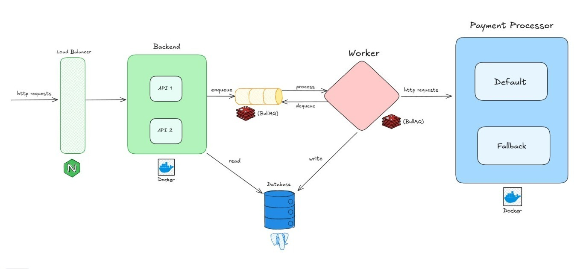

# 🥊 Rinha de Backend

Este projeto é uma API de alta performance desenvolvida com [NestJS](https://nestjs.com/) para a competição [Rinha de Backend](https://github.com/zanfranceschi/rinha-de-backend-2025). A aplicação foi pensada para escalar bem sob carga, utilizando balanceamento, processamento assíncrono e banco de dados relacional.

<p align="center">
  
</p>

---

## 🚀 Tecnologias

- **NestJS** – Framework TypeScript para construir APIs escaláveis e modulares.
- **PostgreSQL** – Banco de dados relacional usado para armazenar transações.
- **Nginx** – Atua como balanceador de carga entre múltiplas instâncias da API.
- **BullMQ** – Gerencia filas de tarefas assíncronas

---

---

## ▶️ Como Executar

```bash
git clone https://github.com/vitortvale/rinha-de-backend-nestjs.git rinha
cd rinha
docker compose up --build
